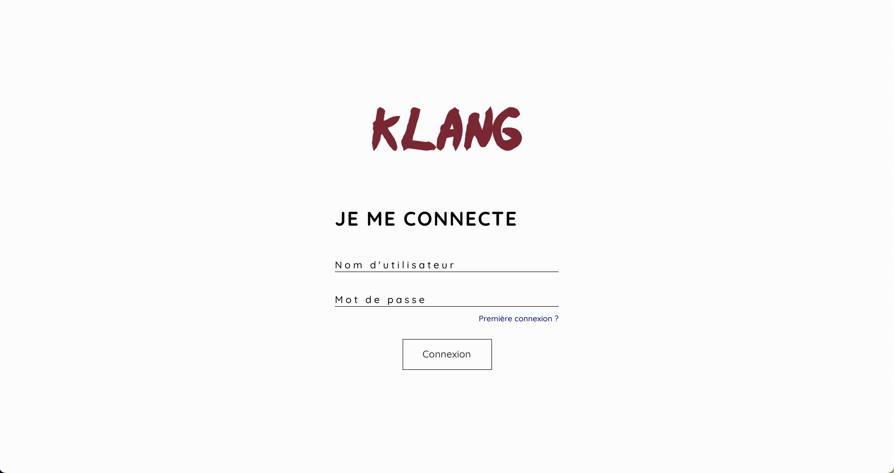
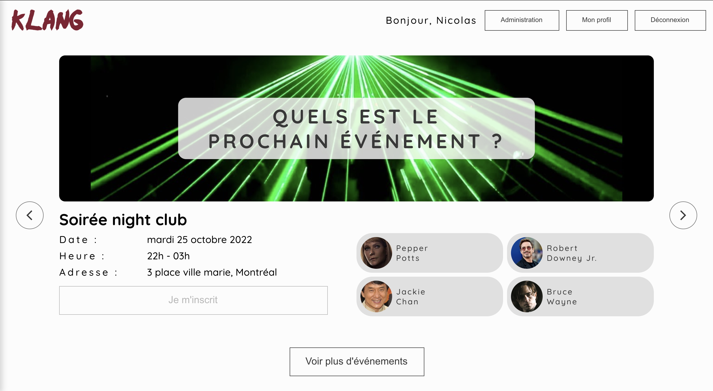
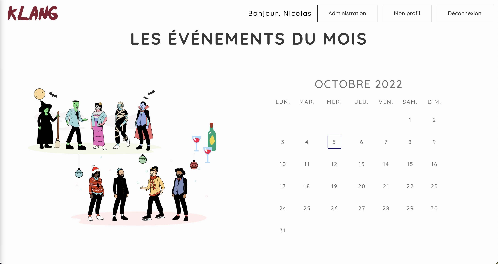
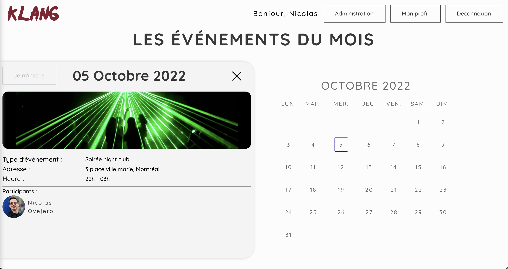
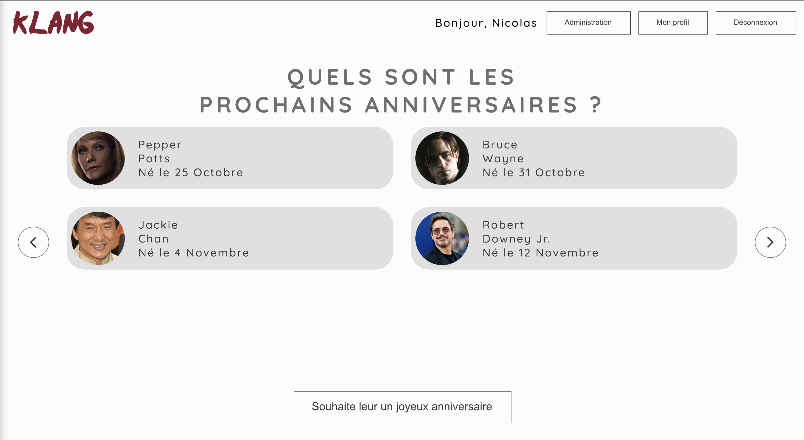
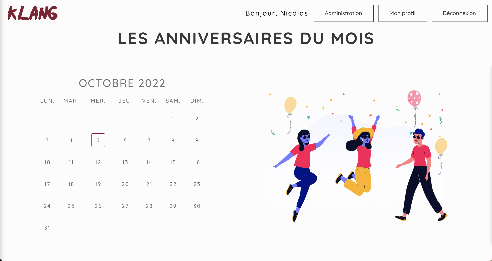
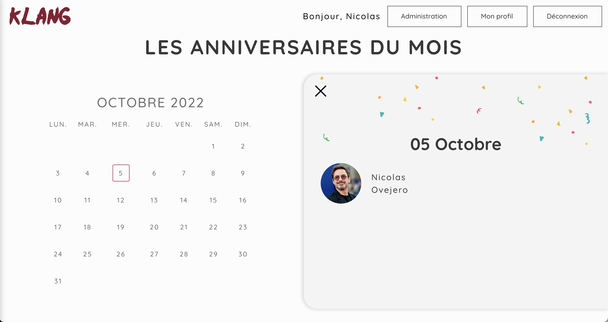
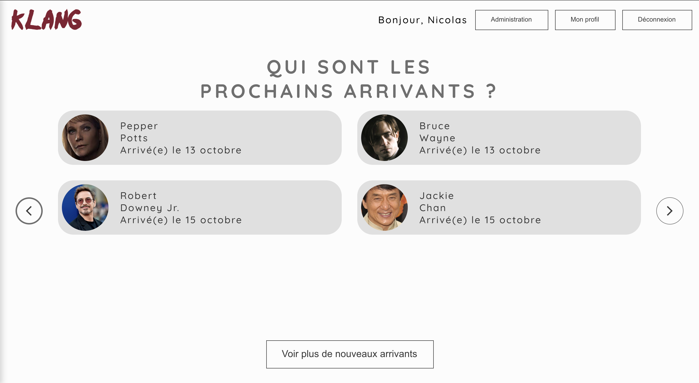
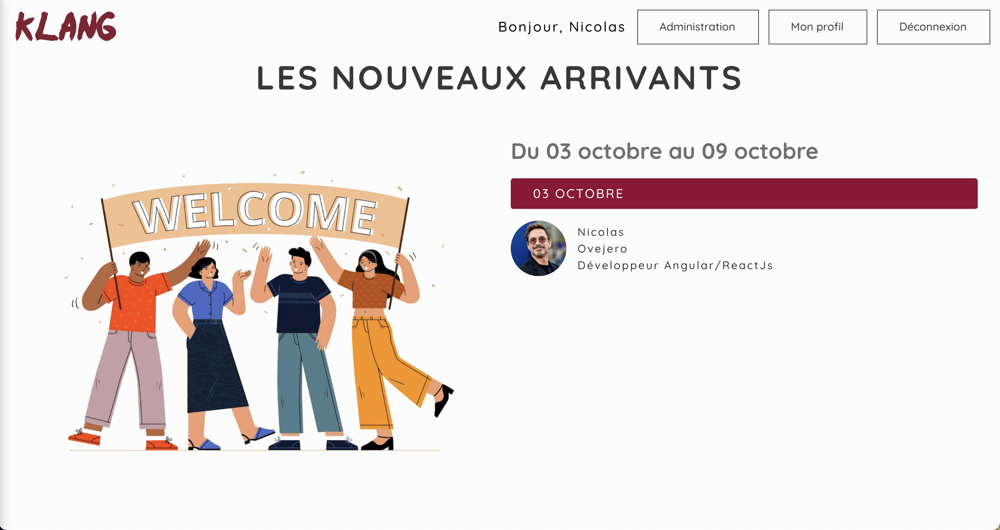
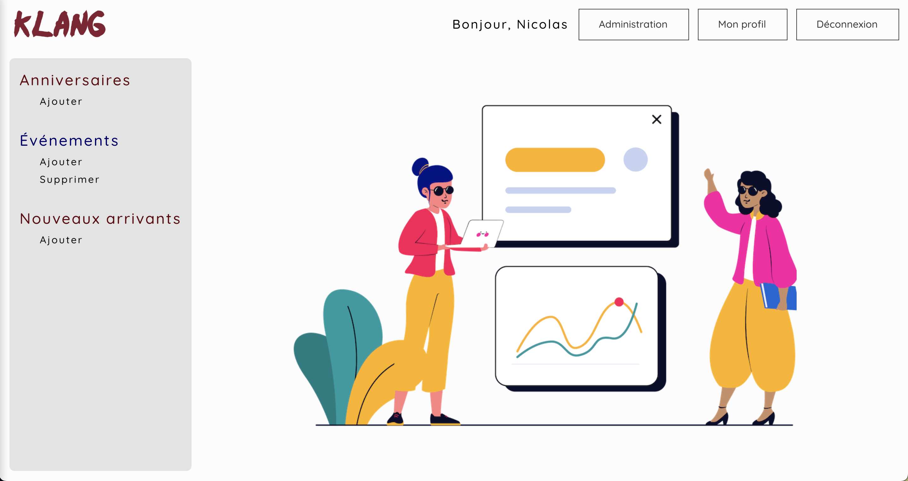

# Klang

## One website - Many information

On the Klang web site, you can see different information like birthdays of your colleagues, 
the next person who will come into your company, and all events share with your company.

-----

## Login

To access to the website, the administrator must create the accounts.

After, you can go to the login page and just enter your secret credentials.

The first time, you will need to set a password.

-----

## Events

All website's administrators can create an event. 

For the event, they must put:
* An image
* The date
* The place
* The schedule
* The type (ex: night party)

After the creation, all users will see the event and they can subscribe to the events.

-----

## Birthday

You can see the birthdays to come.

On the first page you will see the 6 next birthdays on the 2 next months. 
And if you click on the button to see more birthdays, you will have access to all birthdays of the current month.

In the month view, for each user you can click on the action button and send an email to this user to which a good birthday. 

-----

## New arrivals

You can retrieve the new users also.

-----

## Administration

